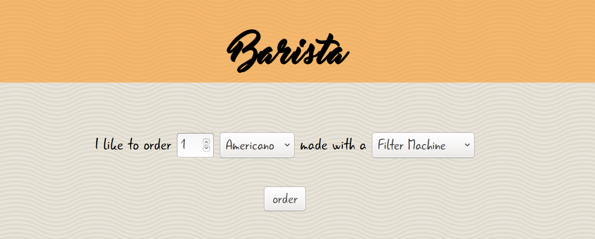

# Barista

This is the famous Barista service.

You can order:

|Coffee|Price\*|
|----|----|
|Americano|1.50€
|Cappuccino|2.00€
|Espresso|1.30€
|~~Latte Macchiato~~|2.20€
|Moccaccino|2.30€

\* prices change according to their preparation process

# About
Learning about docker and jenkins by running state-less webservers. This example application was crafted for learning purpose as part of a lecture about continuous integration (CI) and delivery (CD) at the Cologne University of Applied Sciences (TH Köln).

# Getting Started
This is an example webserver written in python3 with flask. With docker you can run this application in any environment, where docker can be installed. You even do not have to care about downloading any dependencies for the project, because docker will care about this for you.

**install** git and docker, if you don't have it yet:

*git*

    https://git-scm.com/book/en/v2/Getting-Started-Installing-Git
    
or a fancy git GUI

    https://git-scm.com/downloads/guis
    
*docker*

    https://docs.docker.com/linux/step_one/

**build** a docker image of the webserver:

    git clone https://github.com/swiesend/barista barista
    cd barista
    docker build -t barista .
    
**run** it in a docker container (e.g. on port 5000):

    docker run -d -p 5000:5000 barista

**use** the app in your favorite browser and play around:

    http://localhost:5000

# Configuration

    NOTE: This webserver configuration is not for production use!

For production use a configuration which might be more like this:

https://realpython.com/blog/python/dockerizing-flask-with-compose-and-machine-from-localhost-to-the-cloud/

# Issues

This example issues are here for training with jenkins.

## [todo] Setup a post-receive hook for Jenkins with GitHub plugin

ok, let's setup a hook:

* go to the repository `Settings`
* click `Webhooks & services` on the left
* click `Add service` button
* type `Jenkins (GitHub plugin)`
* enter the following url to Jenkins hook url

    http://78.46.74.23:8080/github-webhook/

you should see something like this as response on the top:

    Okay, that hook was successfully created.

done!

## [bug] Missing 'Latte Macchiato'

Oh, no the 'Latte Macchiato' is missing. A customer has raised an issue to this topic. Please fix the problem.

**check** the coffee module to find a solution:

    barista/coffee.py
